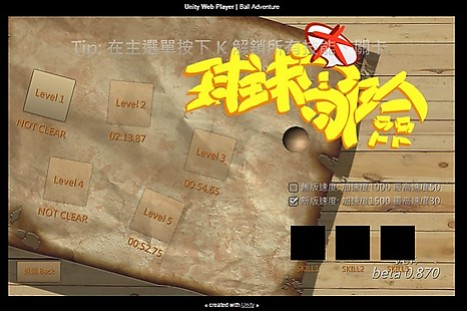
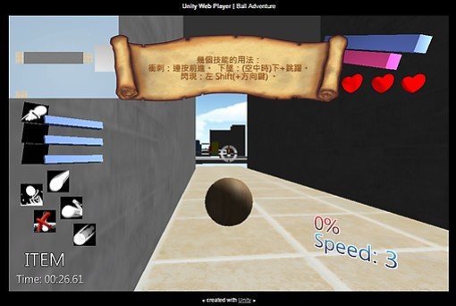
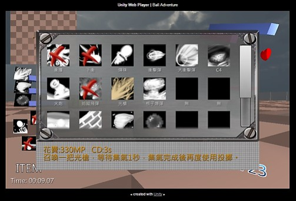
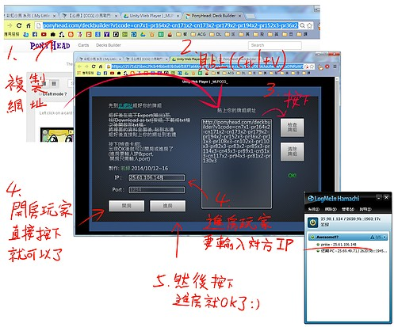
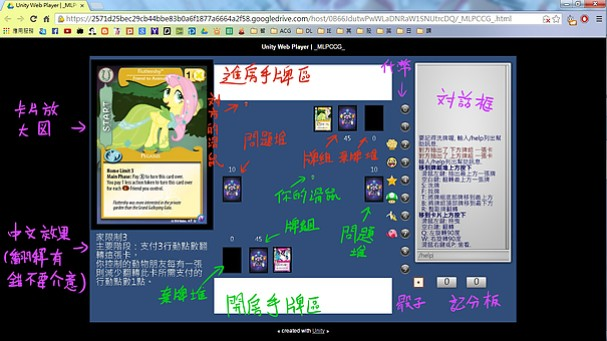
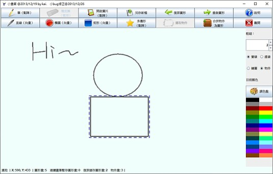

# 專案經歷

### 良率分析系統

>此系統為目前公司所開發專案之一，生管部門原本作業情況是，每天作業員將板子所紀錄到的缺點，用紙張記錄起來交給領班，領班再使用Excel紀錄當天的缺點數目，再用Excel計算當天良率，於隔天報告。
>
>為了實現無紙、自動化，生管與我們IT討論開發此專案。此專案功能為，讓作業員使用手機APP掃描製程後，依據所發現的缺點數用手機進行記錄上傳至資料庫，而可以在web上檢視、匯出這些資料，也能利用這些資料整理出良率並匯出報表。
>
>此專案前端、後端、手機，皆是自己製作的，分別功能如下
>
>>資料庫(MySQL)：了解對方需求後，建置欄位、記錄、數值表。
>
>>前端(JS)：生管可從此介面設定需要填寫的欄位，可檢視、匯出上傳數據，產出分析報表Excel。
>
>>手機端(Android、Kotlin)：作業員使用手機掃描製程、填寫缺點記錄，並上傳。
>
>>後端(PHP)：前端請求回傳、每日早上自動手機通知良率、數據分析在此計算。
>
>還有其他許多專案，因此專案自己開發所涵蓋的技術面比較多，所以提出介紹。

### 長德醫療

>這是與一位在接案朋友一起做的，主要接案為朋友，我則與他一起開發。
>
>我們開發前端APP，API文件、後端則是由其他外包單位製作。

___
# 自我介紹

您好，我是魏麒凱，我喜歡寫程式、玩遊戲、欣賞影片，討厭複雜的事物，喜歡將複雜的事情簡單化、流程化、自動化。

我自己對撰寫程式時有些要求，對程式註解、變數命名、排版，也喜歡整理程式碼，我認為這是很重要的。我撰寫時，也都是先將流程、註解先打出來，然後在依每個段落完成該段落的程式，也會考慮該段程式的可擴充性、可重複利用性，在未來回顧時，不怕忘記以前自己寫了什麼，也能了解當時自己在想的事情。

我喜歡項目完成時的成就感，期待使用者給予的反饋，如果自己有想到更好的解決辦法，也提供給對方參考、討論，調整專案方向。

___
# 熟悉工具

### 高階語言
>JS、PHP、Java、Kotlin、C# ……，若需要其他語言，花幾天學習可上手、能快速轉換。

### 關聯性資料庫
>使用過MySQL、MSSQL、Oracle、SQLite，對任一關聯性資料庫，基本CRUD沒問題，也能進行較複雜的關聯(join)，懂設計ER-model。

### 其他熟悉工具
>Git、VSCode、Android Studio、Excel、HTML、CSS ……。

___
# [codewars 解題練習網站](https://www.codewars.com)

[該網站中我的個人頁面](https://www.codewars.com/users/wkai2573) 

這是一個解題練習網站，我滿喜歡的解題網站，裡面有許多人自製的題目，我自己認為比起其他練習網站，這裡的題目更有趣也更有挑戰性，我尤其喜歡解裡面的遊戲題。

它將題目分為8個等級，數字越低，難度越高。這裡面4級~1級通常都會是一個很完整的題目，3級難度我就需要解好幾個小時了，2級更是想了好幾天才解了出來。

以下列了幾項我之前有解出且有趣的題目。

### 3級
* [Fix the pipes - #2 - is it leaking?](https://www.codewars.com/kata/59f81fe146d84322ed00001e)
* [Make a spiral](https://www.codewars.com/kata/534e01fbbb17187c7e0000c6)
* [Multiplying numbers as strings: Part II](https://www.codewars.com/kata/5923fbc72eafa9bcff00011a)

### 2級
* [ASCII Games: Dance Dance Evolution I](https://www.codewars.com/kata/58f58dc3663082a4ba000033)
* [Break the pieces](https://www.codewars.com/kata/527fde8d24b9309d9b000c4e)

___
# 其他作品

### [Unity3D-球球大冒險](https://docs.google.com/spreadsheets/d/1ozNNlVuyqyCDiFC6wknLSswHW2Q5zc-xclvC9NUs46A/edit?pli=1#gid=1416828017)
>這是我的大學專題，做遊戲是我的興趣，所以選了遊戲來當作我的畢業專題。
>
>遊戲中玩家控制使用一顆球闖關，關卡中會獲得許多技能，並可以選擇技能裝備使用。最後一關要挑戰魔王，運用之前所收集的技能技巧擊敗魔王吧。
>
>
>
>

### Unity3D-小馬卡牌遊戲MLPCCG
>大學時期製作，當時我表哥做這款卡牌遊戲有興趣，當時我趁著熟悉Unity的時候做了這一款可以連線的桌遊遊戲。當時做這款遊戲也只是想練習製作看看連線功能。
>
>這款遊戲可以將製作好的牌組做成字串，輸入字串代表你所要使用的牌組，遊戲時兩人對戰，遊戲提供各種翻牌、洗牌功能，並且對方做了什麼，會在訊息框顯示出動作，所以這就像是在桌面上玩牌一樣，卡牌該怎麼處理一樣是由玩家們決定，遊戲則是提供了遊戲道具與紀錄等功能。
>
>
>

### Java-小畫家
>大學時期製作，使用Java製作的小畫家，可以畫幾何圖形，也可載入、儲存圖片。
>
>

